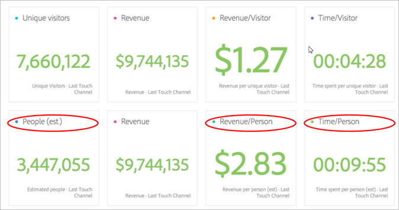
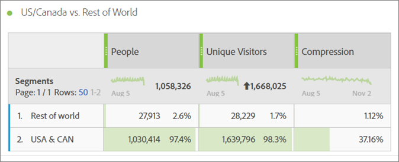
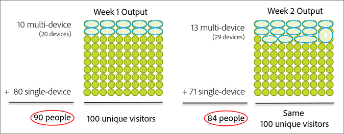
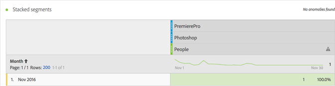
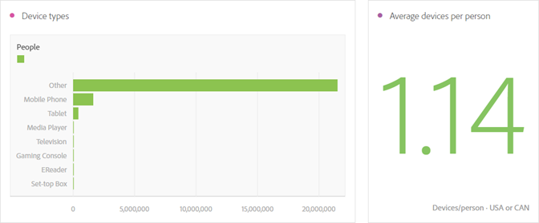
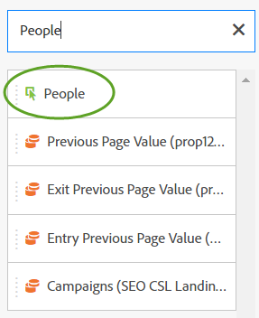

# 人員量度{#people-metric}

「人員」量度是根據Adobe裝置圖表計算人員（或裝置群組）的計數。 您可以套用「人員」量度，在分析工作區中跨裝置識別訪客。

## 人員量度的先決條件與考量事項 {#section-34551d0435fb4b3cb3fad736b7961541}

<table id="table_120F7EF50042485391E58B22DD00A2A8"> 
 <thead> 
  <tr> 
   <th colname="col1" class="entry"> 先決條件或考慮事項 </th> 
   <th colname="col2" class="entry"> 說明 </th> 
  </tr>
 </thead>
 <tbody> 
  <tr> 
   <td colname="col1"> 
Device Co-op 
 </td> 
   <td colname="col2"> 
 若要使用「人員」量度，請成為 <a href="http://landing.adobe.com/en/na/events/summit/275658-summit-co-op.html" format="html" scope="external"> Adobe Experience Cloud Device Co-op的會員</a>。 Co-op可識別個人的多種裝置（或Experience Cloud ID）。 Analytics利用這項資訊，統計得出與品牌互動的人數。 量度精確到5%以內。 
 
<b>地區</b>: Device Co-op目前僅在美國和加拿大提供。 因此，在評估「人員」量度時，您應套用區段至分析，以僅篩選美國和加拿大的資料。 
 
每週，裝置圖表都會計算合作社的新版本，並發佈供使用。 星期二，系統會收集最新資料並發佈圖形的更新版本。 然後，Experience Cloud解決方案會使用圖形的最新版本。 尤其是Analytics，變更會在星期三讀入，而處理變更通常需要1到2個工作天。 
 
 
重要：  每週更新圖表時，它會影響「人員」量度的歷史記錄。 換言之，歷史「人員」計數會隨著圖形學習和更新而隨時間而變更。 例如，如果您今天執行上個月計算人數的報表，然後在圖形更新後一週內執行相同的報表，則歷史人數會稍有變更。 
 
 </td> 
  </tr> 
  <tr> 
   <td colname="col1"> 量度權限 </td> 
   <td colname="col2"> 
您只有在已授予存取權時，才可使用「人員」量度。 管理員可<a href="https://docs.adobe.com/content/help/en/analytics/admin/user-product-management/customize-report-access/groups-metrics.html" format="html" scope="external"> 在「管理工具</a> 」中自訂量度權限。 
 </td> 
  </tr> 
  <tr> 
   <td colname="col1"> 對應至IMS組織 </td> 
   <td colname="col2"> 
「人員量度」將會針對對應至IMSORG的所有報 <a href="https://docs.adobe.com/content/help/zh-Hant/core-services/interface/about-core-services/report-suite-mapping.html" format="html" scope="external"> 表套裝啟用</a>。 
 </td> 
  </tr> 
  <tr> 
   <td colname="col1"> 
分析專案／工具 
 </td> 
   <td colname="col2"> 
使用分析工作區、臨  機分析、報告建立工具中的「人員」量度，並透過API使用。 您可以隨處使用「獨特訪客」量度，包括「計算量度」。 
 
例如，建立每人收入量度以取代每獨特訪客收入量度。 
 
「人 <a href="https://docs.adobe.com/content/help/zh-Hant/analytics/analyze/analysis-workspace/build-workspace-project/starter-projects.html" format="html" scope="external"> 員」專案範本</a> ，可供您在分析工作區中開始使用「人員」量度。 
 </td> 
  </tr> 
  <tr> 
   <td colname="col1"> 
開啟機器人規則 
 </td> 
   <td colname="col2"> 
Adobe建議您開啟「機器人規 <a href="https://docs.adobe.com/content/help/en/analytics/admin/admin-tools/bot-removal/bot-rules.html" format="html" scope="external"> 則」</a>，尤其是使用「人員」度量時。 
 
當機器人爬行您的網站時，會人為地增加您的獨特訪客計數。 從報表套裝移除機器人流量，可更精確地測量數位屬性上的活動，包括獨特訪客和訪客。 
 
若要這麼做，請導覽至「  Analytics &gt;管  理 &gt;報表  套裝」。 Select the correct report suite, and then go to  Edit Settings &gt;  General &gt;  Bot Rules. 
 </td> 
  </tr> 
  <tr> 
   <td colname="col1"> 
區段考量事項 
 </td> 
   <td colname="col2"> 
 當您搭配使用區段與人員度量時，度量報表可能會顯著低於預期。 
 
請參 <a href="../other-solutions/people.md#section-d03525420dbe48379fd95b230ef05885" format="dita" scope="local"> 閱搭配使用人員量度與區段</a>。 
 </td> 
  </tr> 
 </tbody> 
</table>

## 什麼是人員量度？ {#section-89e2b8f5e80f480391449fc8d1117a6a}

「人員」量度是Analytics報表量度，可協助您將裝置歸因於人員。 它提供以人為本的行銷檢視，讓您測量訪客在所有裝置上的活動。 您可將其視為「獨特訪客」的去重複化版本，而您可使用「人員」量度來分析先前使用「獨特訪客」的位置。

**裝置是人**

在「人員」量度可用之前，某人（例如）可能造訪您的網站，並在三種不同裝置上與促銷活動或品牌互動並進行購買，即使在幾分鐘內也是如此。 視您的實作而定，Analytics可能會將每個裝置報告為獨特訪客，並在$30的購買中將$10歸因於三個裝置。

「人員」量度可讓您將購買$30的商品準確歸因為一個人：

**提高報表的精確度**

「人員」量度可讓您將多種裝置視為單一實體。 下列分析工作區專案顯示「獨特訪客」報表與「人員」報表之間的精確度比較：

並排比較人員和獨特訪客：

**定義**

<table id="table_F8171AF15DA64607B427E3739EF004D6"> 
 <thead> 
  <tr> 
   <th colname="col1" class="entry"> 項目 </th> 
   <th colname="col2" class="entry"> 說明 </th> 
  </tr>
 </thead>
 <tbody> 
  <tr> 
   <td colname="col1"> 
People 
 </td> 
   <td colname="col2"> 
「人物」量度是以消費者使用多種裝置與品牌互動的理念為基礎。 分割或分段資料的次數越多，同一人在該資料片段中使用多個裝置的機會就越小。 
 </td> 
  </tr> 
  <tr> 
   <td colname="col1"> 
不重複訪客 
 </td> 
   <td colname="col2"> 
例如，您依日期或時間劃分資料的次數越多，「人員」與「獨特訪客」的差異就越小。 如果您想要深入瞭解Device Co-op的整體影響，Adobe建議使用過去90天的日期範圍 
 </td> 
  </tr> 
  <tr> 
   <td colname="col1"> 
壓縮 
 </td> 
   <td colname="col2"> 
使用簡單的計算量度，您可以看到「人員」量度佔「獨特訪客」的百分比有多小。 按一下上表「壓縮」旁的資訊圖示，以瞭解如何建立此量度。 
 
人員可用於其他計算量度，以取代獨特訪客。 
 </td> 
  </tr> 
 </tbody> 
</table>

## 人員量度的計算方式為何？ {#section-0dfb762867e14a7f927796ef3c50592b}

<!--

Analytics uses the HyperLogLog statistical algorithm to calculate People. This means that the smaller the data set, the margin for error may increase. No more than 5% of the numbers should be off by more than 5% 

-->

下圖顯示如何計算「人員」量度，以及如何隨著時間減少過去相同報表日期範圍的量度。

在此範例中，假設有一組固定的訪客。 如果您在過去的固定時段內執行報表，報表會顯示一組固定訪客。 如果裝置圖表在第1週輸出左圖上顯示的資料，則會產生90人。 一週後，裝置圖表的下次執行後，就會考量到新資訊。 如果你運行的報告和一週前一樣，人數已經減少到84人。 歷史記錄已變更，因為「裝置圖」提供了有關哪些裝置應組合在一起的新資訊。

## 搭配區段使用人員量度 {#section-d03525420dbe48379fd95b230ef05885}

當您搭配使用群體與人物量度時，量度結果可能會顯著低於預期。 發生此問題是因為，在區段中沒有容 *`person`* 器。 區段會使用訪客容器，這是定義中最高層級的容器，並以裝置為基礎，而非以人為基礎。

此問題主要發生在將區段堆疊成「人員」度量時。

堆疊區段會建立新區段，代表區段的組合。 堆疊區段會在您執行下列動作時發生：

* 將區段置於分析工作區中其他區段的上方。 (這些會使用運算子自動 *`And`* 連結。)
* 套用包含運算子的單一 *`And`* 區段。
* 在專案層級和表格層級套用區段。
* 搭配另一個區段使用虛擬報表套裝。

例如，假設您在「人員」量度上堆疊下列區段：

* `Campaign = Spring Promotion`
* `Site Section = Product Overview`

只會計入兩個區段中符合資格的人 *`using a single device`* 數。 （「人員」量度不會顯示跨裝置的合格人數。）

此外，在此情 *`Or`* 況下不建議使用運算子。 如此會產生一個或另一個人的計數，而無法計算有多少人符合這兩個群體的資格。

如需詳 [細資訊](https://docs.adobe.com/content/help/zh-Hant/analytics/components/segmentation/segmentation-workflow/seg-build.html) ，請參閱區段說明中的建立區段。

## 裝置類型 {#section-8ab378c84ff34574b9c20fecb3848a86}

當您的報表套裝包含來自多種裝置類型的資料時，「裝置合作與人員」量度在Adobe Analytics中最有效。 例如，將網頁和應用程式資料結合至相同的報表套裝，可讓「人員」量度更強大且更有效。 資料中的跨裝置越多，多個獨特訪客被分組為單一人的可能性就越大。

## Experience Cloud ID Service Coverage {#section-bbf0098cac2e467289e7a644a1dea05c}

Device Co-op要求您的數位屬性必須使用Experience Cloud ID(MCID)服務進行檢測。 如果報表套裝中的資料包含大量沒有MCID的訪客，則Device Co-op和「人員」量度的效能會降低。

<!--
mcdc-people-metric-apply.xml
-->

在分析工作區中，建 [立專案](https://docs.adobe.com/content/help/en/analytics/analyze/analysis-workspace/build-workspace-project/t-freeform-project.html)，然後將 **[!UICONTROL People]** 量度拖曳至專案表格：

