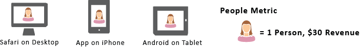

# 人員量度{#people-metric}

「人物」量度是根據Adobe的「裝置圖表」所計算出的人物（或裝置群組）數量。 您可以套用「人物」量度來識別Analysis Workspace中跨裝置訪客。

## 人員量度先決條件和考量事項 {#section-34551d0435fb4b3cb3fad736b7961541}

<table id="table_120F7EF50042485391E58B22DD00A2A8"> 
 <thead> 
  <tr> 
   <th colname="col1" class="entry"> 必要條件或考量 </th> 
   <th colname="col2" class="entry"> 說明 </th> 
  </tr>
 </thead>
 <tbody> 
  <tr> 
   <td colname="col1"> 
Device Co-op 
 </td> 
   <td colname="col2"> 
 若要使用「人物」量度，請成為 <a href="http://landing.adobe.com/en/na/events/summit/275658-summit-co-op.html" format="html" scope="external"> Adobe Experience Cloud Device Co-op</a>. co-op可識別個人的多部裝置(或Experience CloudID)。 Analytics會利用這些資訊，以統計方式匯出與品牌互動的人數。 量度的精確度在5%以內。 
 
<b>地區</b>：Device Co-op目前僅在美國和加拿大提供。 因此，在評估「人物」量度時，您應套用區段至分析，以便僅篩選美國與加拿大的資料。 
 
每週，「裝置圖表」都會計算新版co-op，並發佈以供使用。 星期二，系統會收集最新資料並發佈圖形的更新版本。 然後Experience Cloud解決方案會使用最新版本的圖表。 對於Analytics而言，變更會在星期三讀取，處理變更通常需要1到2個工作日。 
 
 
重要：圖表每週更新時，可能會影響人員量度歷史記錄。 換言之，隨著圖表學習並更新，歷史人員計數可能會隨著時間而改變。 例如，如果您在今天執行會計為上個月人員數的報表，然後在圖表更新後的一週內執行相同的報表，歷史人員計數可能會稍微變更。 
 
 </td> 
  </tr> 
  <tr> 
   <td colname="col1"> 量度許可權 </td> 
   <td colname="col2"> 
只有當您已被授予存取權時，才能使用「人物」量度。 管理員可以<a href="https://docs.adobe.com/content/help/en/analytics/admin/user-product-management/customize-report-access/groups-metrics.html" format="html" scope="external"> 自訂量度許可權</a> （在管理工具中）。 
 </td> 
  </tr> 
  <tr> 
   <td colname="col1"> 對應到IMS組織 </td> 
   <td colname="col2"> 
「人物」量度將針對以下所有報表套裝啟用： <a href="https://docs.adobe.com/content/help/zh-Hant/core-services/interface/about-core-services/report-suite-mapping.html" format="html" scope="external"> 對應至IMSORG</a>. 
 </td> 
  </tr> 
  <tr> 
   <td colname="col1"> 
分析專案/工具 
 </td> 
   <td colname="col2"> 
在中使用人員量度  Analysis Workspace，  Ad Hoc Analysis，  Report Builder，並透過API存取。 您可以在使用「不重複訪客」量度（包括計算量度）的任何地方使用此量度。 
 
例如，建立每人收入量度來取代每人收入不重複訪客量度。 
 
A <a href="https://docs.adobe.com/content/help/zh-Hant/analytics/analyze/analysis-workspace/build-workspace-project/starter-projects.html" format="html" scope="external"> 人員專案範本</a> 可開始使用Analysis Workspace中的「人物」量度。 
 </td> 
  </tr> 
  <tr> 
   <td colname="col1"> 
開啟機器人規則 
 </td> 
   <td colname="col2"> 
Adobe建議您開啟 <a href="https://docs.adobe.com/content/help/en/analytics/admin/admin-tools/bot-removal/bot-rules.html" format="html" scope="external"> 機器人規則</a>，尤其是使用「人物」量度時。 
 
當機器人對您的網站進行編目時，會以人為方式增加您的獨特訪客計數。 從報表套裝中移除機器人流量，可針對數位財產上的活動提供更準確的測量，包含不重複訪客和人員兩個方面。 
 
若要這麼做，請導覽至  分析 &gt;  管理員 &gt;  報表套裝. 選取正確的報表套裝，然後前往  編輯設定 &gt;  一般 &gt;  機器人規則. 
 </td> 
  </tr> 
  <tr> 
   <td colname="col1"> 
區段考量事項 
 </td> 
   <td colname="col2"> 
 當您使用區段搭配「人物」量度時，量度報表可能會顯著低於預期。 
 
另請參閱 <a href="../other-solutions/people.md#section-d03525420dbe48379fd95b230ef05885" format="dita" scope="local"> 搭配區段使用人員量度</a>. 
 </td> 
  </tr> 
 </tbody> 
</table>

## 什麼是人員量度？ {#section-89e2b8f5e80f480391449fc8d1117a6a}

「人物」量度是Analytics報表量度，可協助您將裝置歸因於人物。 它提供以人物為基礎的行銷檢視，可讓您測量訪客在其所有裝置上的活動。 將其視為「不重複訪客」的去重複版本，然後您可以使用「人物」量度來分析，其中您先前使用的是「不重複訪客」。

**裝置為使用者**

在「人物」量度可用之前，使用者（例如）可能會造訪您的網站，並在三個不同的裝置上參與促銷活動或品牌並進行購買，即便是在幾分鐘內完成。 根據您的實作，Analytics可能會將每個裝置回報為不重複訪客，並在30美元的購買中將價值$10的裝置歸因於3個裝置。

「人物」量度可讓您準確地將該$30美元的購買歸因於一個人：

**提高報表的正確性**

「人物」量度可讓您將多個裝置視為單一實體。 下列Analysis Workspace專案顯示「不重複訪客」報表和「人物」報表之間的比較準確度提高：

並排比較使用者和不重複訪客：

**定義**

<table id="table_F8171AF15DA64607B427E3739EF004D6"> 
 <thead> 
  <tr> 
   <th colname="col1" class="entry"> 項目 </th> 
   <th colname="col2" class="entry"> 說明 </th> 
  </tr>
 </thead>
 <tbody> 
  <tr> 
   <td colname="col1"> 
人員 
 </td> 
   <td colname="col2"> 
「人物」量度是根據消費者使用多部裝置與您品牌互動的構想。 您對資料分割或區隔得越多，同一人在該資料分割內使用多部裝置的機會就越小。 
 </td> 
  </tr> 
  <tr> 
   <td colname="col1"> 
不重複訪客 
 </td> 
   <td colname="col2"> 
例如，您依日期或時間對資料分割得越多，「人物」和「不重複訪客」之間的差異就越小。 如果您想深入瞭解Device Co-op的整體影響，Adobe建議您使用過去90天的日期範圍 
 </td> 
  </tr> 
  <tr> 
   <td colname="col1"> 
壓縮 
 </td> 
   <td colname="col2"> 
透過簡單的計算量度，您可以看到「人物」量度相對於「不重複訪客」的百分比小了多少。 按一下上表中「壓縮」旁的資訊圖示，檢視如何建立此量度。 
 
人員可用在其他計算量度中，以取代「不重複訪客」。 
 </td> 
  </tr> 
 </tbody> 
</table>

## 「人物」量度如何計算？ {#section-0dfb762867e14a7f927796ef3c50592b}

<!--

Analytics uses the HyperLogLog statistical algorithm to calculate People. This means that the smaller the data set, the margin for error may increase. No more than 5% of the numbers should be off by more than 5% 

-->

下圖顯示「人物」量度的計算方式，以及對於過去的相同報表日期範圍，量度如何隨著時間減少。

在此範例中，假設有一組固定的訪客。 如果您執行過去固定時間範圍的報表，則會顯示固定訪客集。 如果裝置圖表在第1週輸出左側圖表中顯示的資料，則結果為90人。 一週後，在下次執行裝置圖表後，會將新資訊列入考量。 如果您執行一週前執行的相同報告，人數已降至84人。 歷程記錄已變更，因為裝置圖表提供有關哪些裝置應該分組在一起的新資訊。

## 搭配區段使用人員量度 {#section-d03525420dbe48379fd95b230ef05885}

當您使用區段搭配「人物」量度時，量度結果可能會顯著低於預期。 發生此問題是因為分段中沒有 *`person`* 容器。 區段使用訪客容器，這是定義中最高層級的容器，且以裝置為基礎，而不是以人員為基礎。

此問題主要發生於將區段與「人物」量度棧疊時。

棧疊區段會建立代表區段組合的新區段。 每當您：

* 將區段放在Analysis Workspace中另一個區段上方。 (這些會使用 *`And`* 運運算元)。
* 套用包含 *`And`* 運運算元。
* 在專案和表格層級套用區段。
* 將虛擬報表套裝與其他區段搭配使用。

例如，假設您在「人物」量度上棧疊下列區段：

* `Campaign = Spring Promotion`
* `Site Section = Product Overview`

只有兩個區段中符合資格的人數 *`using a single device`* 計數。 （「人物」量度不會顯示跨裝置的合格人士數量。）

此外，使用 *`Or`* 運運算元不建議在此情況下。 這樣做會計算看到其中一個區段的人數，而無法計算有多少人符合兩個區段的資格。

另請參閱 [建立區段](https://docs.adobe.com/content/help/zh-Hant/analytics/components/segmentation/segmentation-workflow/seg-build.html) 如需詳細資訊，請參閱區段說明。

## 裝置類型 {#section-8ab378c84ff34574b9c20fecb3848a86}

當報表套裝包含多種裝置型別的資料時，Device Co-op和「人物」量度在Adobe Analytics中的運作成效最佳。 例如，在相同的報表套裝中結合網頁和應用程式資料，可讓「人物」量度更有效率。 資料中的裝置交叉越多，多個不重複訪客會以單一人員身分分組到一起的機會就越大。

## Experience CloudID服務涵蓋範圍 {#section-bbf0098cac2e467289e7a644a1dea05c}

Device Co-op需要使用Experience CloudID (MCID)服務來檢測您的數位屬性。 如果報表套裝中的資料包含大量沒有MCID的訪客，Device Co-op和「人物」量度的有效性就會降低。

<!--
mcdc-people-metric-apply.xml
-->

在Analysis Workspace中，建立 [專案](https://docs.adobe.com/content/help/zh-Hant/analytics/analyze/analysis-workspace/build-workspace-project/t-freeform-project.html)，然後拖曳 **[!UICONTROL People]** 專案表格的量度：

