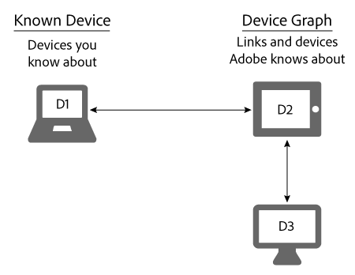

# 已知裝置{#known-devices}

關於裝置圖表中的已知裝置。

在裝置圖表中，我們有 *`known device`*. 已知裝置是客戶用來與您的品牌互動的裝置。

>[!NOTE]
>
>在 [!DNL Adobe Experience Cloud Device Co-op]，辭彙，例如 *`device`*， *`person`*， *`identity`* 等 具有特定意義。 例如，「裝置」可以指實體硬體，例如手機或平板電腦，以及在該硬體上執行的應用程式。 請參閱 [字彙表](../glossary.md#glossgroup-0f47d7fbd76c4759801f565f341a386c) 定義。

## 使用已知裝置支援目標 {#section-80deae33660e4280ac65c659ceff5601}

已知裝置概念支援幾個目標，這些目標對於建立和維護有效的 [!DNL Device Co-op] 程式。 已知裝置是指 [!DNL Device Co-op] 成員可透過與消費者的某些互動（例如網站造訪或使用行動應用程式）得知資訊。 根據這些動作， [!DNL Device Graph] 連結的已知裝置 [!DNL Device Co-op] 成員至由其他使用者貢獻的裝置 [!DNL Device Co-op] 成員。 這些連結可以是 [確定性或機率](../processes/links.md#concept-58bb7ab25f904f5f98d645e35205c931). 此優點 [!DNL Device Co-op] 成員，因為他們收到：

* 有關其已知裝置的更多資料。
* 關於其他連結裝置的新資訊。

此 [!DNL Device Graph] 不會提供Device Co-op成員尚未看到的裝置叢集相關資訊。

## Device Co-op目標 {#section-75aea5a102d54733aae2a7c6ee9ec6c7}

三個主要目標使 [!DNL Device Co-op]. 這些類別包括：

* **縮放：** 在各種使用案例間共用最大數量的可能連結。
* **公平：** 確定每個成員的 [!DNL Device Co-op] 與其貢獻相稱的方式獲得福利。

* **消費者信任：** 透過確保消費者跨裝置體驗涉及他們熟悉且信任的品牌，來維持及建立消費者信心。

## 縮放和已知裝置 {#section-67f734109762457ca62ec306284ea082}

下列是裝置符合已知裝置資格的較常見方式。 基於這些方法， [!DNL Device Co-op] 成員幾乎都會擁有至少1部已知裝置。 這支援為以下專案的所有成員提供最大比例的目標： [!DNL Device Co-op].

**有機**

* 從客戶造訪您的網站或使用您的應用程式。 這是來自第一方資料的資格。
* 透過CRM系統的入門客戶。

**Marketplace**

* 從Audience Marketplace購買區段資料。
* 從第三方資料提供者購買資料。

**Advertising**

透過在拍賣中取得詳細目錄並將廣告提供給裝置。 如果該廣告包含 [!DNL Audience Manager] 畫素。

## 已知裝置和公平使用案例 {#section-0543188729d845d6b95db70b8b25e9f8}

成員 [!DNL Device Co-op] 取得與其貢獻相稱的連結 [!DNL Device Graph]. 為提供大量裝置的公司 [!DNL Device Graph] 收到的連結多於只貢獻了幾個連結的成員。 我們相信這能協助 [!DNL Device Co-op] 對其所有成員來說都是公平的。 讓我們來看看這如何與下述大大小小的使用案例搭配運作。

**品牌A：大型使用案例**

在此範例中，品牌A每月有100位網站訪客，並開始新的跨裝置品牌行銷活動。 為簡單起見，請假設 [!DNL Device Graph] 知道品牌A的所有訪客皆連結至1個額外裝置。 這表示品牌A可觸及其他100部裝置。 此外， [!DNL Device Graph] 包含約200部連結在一起的裝置。

<table id="table_78C38DC522F94BC38C1DB73740C058AC"> 
 <thead> 
  <tr> 
   <th colname="col1" class="entry"> 已知裝置/月 </th> 
   <th colname="col2" class="entry"> 從Device Co-op收到的連結裝置 </th> 
   <th colname="col3" class="entry"> Campaign裝置總數 </th> 
  </tr>
 </thead>
 <tbody> 
  <tr> 
   <td colname="col1"> 
100 
 </td> 
   <td colname="col2"> 
100 
 </td> 
   <td colname="col3"> 
200 
 </td> 
  </tr> 
 </tbody> 
</table>

**品牌B：小型使用案例**

在此範例中，品牌B每月有100位網站訪客，並開始新的跨裝置品牌行銷活動。 為簡單起見，請假設 [!DNL Device Graph] 知道品牌B的所有訪客都已連結至其他50部裝置。 這表示品牌B可觸及150部裝置。 此外， [!DNL Device Graph] 包含約1,000部連結在一起的裝置。

<table id="table_A6C9CCF9C6564A89BA7060E075A8E73C"> 
 <thead> 
  <tr> 
   <th colname="col1" class="entry"> 已知裝置/月 </th> 
   <th colname="col2" class="entry"> 從Device Co-op收到的連結裝置 </th> 
   <th colname="col3" class="entry"> Campaign裝置總數 </th> 
  </tr>
 </thead>
 <tbody> 
  <tr> 
   <td colname="col1"> 
100 
 </td> 
   <td colname="col2"> 
50 
 </td> 
   <td colname="col3"> 
150 
 </td> 
  </tr> 
 </tbody> 
</table>

>[!MORELIKETHIS]
>
>* [未知的裝置](../processes/unknown-device.md#concept-95090d341cdc4c22ba4319d79d8f6e40)

