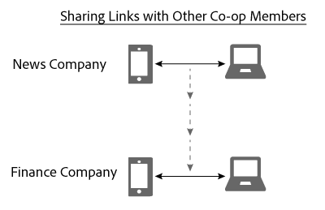

# 裝置圖表中的連結共用{#link-sharing-in-the-device-graph}

關於裝置圖表中的連結共用。

這些 [!DNL Device Graph] 連結會與Adobe Experience Cloud Device Co-op的不同成員共用確定性和概率性連結。 連結共用功能讓網站變得 [!DNL Device Co-op] 如此強大。 它擴展了每個成員對於匿名人員相關設備的瞭解，但前提是您之前至少見過該匿名人員的其中一個設備。

## 裝置圖表摘要審核 {#section-7858e9f61b5644c981ffb53626fcc19d}

在開始之前，我們先花點時間來檢視它的運 [!DNL Device Graph] 作。 將資料發 [!DNL Device Co-op] 送到的成員 [!DNL Device Graph]。 使 [!DNL Device Graph] 用這些資料，從裝置間的確定性和概 [率性連結來建構個人身分](../processes/links.md#concept-58bb7ab25f904f5f98d645e35205c931) 。 身為參 [!DNL Device Co-op] 與者，這些連結可讓您深入瞭解已驗證的使用者、其他使用者及其裝置之間的關係。 讓我們在下節中看看它的運作方式。

## 連結共用範例 {#section-cb410d827cf14f76bc9b0bd4d31ed767}

下列範例說明Device Co-op中連結共用的強大功能。 在此範例中，我們有2家虛構公司，即新聞公司和財務公司。 兩家公司都是公司的成員 [!DNL Device Co-op]。 人員A是從多種裝置登入或瀏覽各公司網站的消費者。

由於Person A已透過其行動電話和平板電腦驗證至新聞網站，因此新聞公司會以消費者ID來識別他們。 它會將該ID以加密雜 [!DNL Device Graph] 湊的方式傳送給。 Finance Company以前也見過這些裝置，但A人員尚未登入網站。 因此，財務公司不知道這些設備是否相互關聯或如何關聯到A人。

給定消費者ID的密碼雜湊，該消 [!DNL Device Graph] 費者識別這些設備彼此相關並且與特定人相關。 對於未參與這些網站瀏覽 [!DNL Device Co-op] 的公司，可能會來自個別的隨機裝置。 無論如何，一旦擁有雜 [!DNL Device Graph] 湊ID，就會：

* 知道行動電話和筆記型電腦是連結的。
* 瞭解Finance Company想要知道行動電話和筆記型電腦是否連結。

基於這些條件，現 [!DNL Device Graph] 在會分享將新聞公司與財務公司的這些裝置連結的連結。 在此程式中，這 [!DNL Device Graph] 些成員會複製並共用一個合作社成員與另一個成員的連結。

此時，已成 [!DNL Device Graph] 功執行其角色。 新聞公司和金融公司都清楚地知道自己的身份。 他們可以跨所有裝置精確觸及A人。

## 隱私權和連結共用 {#section-7b566018b3304420a4b3e4c079826110}

在連結分享程式中，維護會員的消 [!DNL Device Co-op] 費者隱私權和資料完整性至關重要。 在此客戶識別和連結分享程式中， [!DNL Device Graph] 並未：

* 告訴財務公司，連結來自新聞公司。
* 將一個成員使用的客戶ID與另 [!DNL Device Co-op] 一個成員共用。
* 提供行動裝置與筆記型電腦共用共同連結以外的任何資訊。

## 下一步 {#section-ac6e61f1eb6e45b1bb4be8ece39147c7}

閱讀有關身分識別、連結和連結分享的檔案，應該能讓您清楚瞭解資料在內 [!DNL Device Graph] 部的匯整方式。 接下來，我們建議檢視說明如何提供跨裝置連結至Device Co-op會 *`known device`* 員的說明檔案。 請參 [閱「已知設備](../processes/known-device.md#concept-8e87c276819a48bfac5cef10b45216d1) 」和「 [未知設備」](../processes/unknown-device.md#concept-95090d341cdc4c22ba4319d79d8f6e40)。
