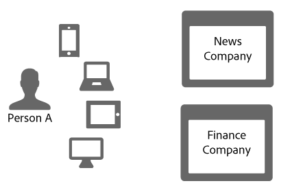

# Link sharing in the Device Graph{#link-sharing-in-the-device-graph}

關於裝置圖表中的連結共用。

The [!DNL Device Graph] shares deterministic and probabilistic links with different members of the Adobe Experience Cloud Device Co-op. Link sharing is what makes the [!DNL Device Co-op] so powerful. 它會將每個成員對於匿名人員的關聯裝置所知道的內容延伸，但僅限於您之前看見過該匿名人員至少一個裝置。

## Device Graph summary review {#section-7858e9f61b5644c981ffb53626fcc19d}

Before getting started, let&#39;s take a moment to review how the [!DNL Device Graph] works. 將資料發 [!DNL Device Co-op] 送到的成員 [!DNL Device Graph]。 使 [!DNL Device Graph] 用這些資料，從裝置間的確定性和概 [率性連結來建構個人身分](../processes/links.md#concept-58bb7ab25f904f5f98d645e35205c931) 。 身為 [!DNL Device Co-op] 參與者，這些連結可提供經驗證的使用者、其他使用者與其裝置之間關係的相關見解。在下一個小節讓我們看一下其運作方式。

## Link sharing example {#section-cb410d827cf14f76bc9b0bd4d31ed767}

下列範例示範 Device Co-op 中連結分享的強大功能。在此範例中，我們有 2 個虛構公司，即新聞公司與財經公司。Both companies are members of the [!DNL Device Co-op]. 人員 A 是從多個裝置登入或瀏覽每個公司網站的消費者。

因為人員 A 已使用其行動電話和平板電腦向新聞網站進行驗證，新聞公司會以消費者識別碼識別他們。It sends that ID to the [!DNL Device Graph] as a cryptographic hash. 財金公司之前看見過這些裝置，但人員 A 未登入網站。結果，財金公司不知道這些裝置是否或如何彼此相關，也不知道裝置如何與人員 A 相關聯。

Given the cryptographic hash of the consumer ID, the [!DNL Device Graph] recognizes that these devices are related to each other and a particular person. 對於未參與 [!DNL Device Co-op] 的公司，這些網站造訪可能會顯示為來自不同、隨機的裝置。In any case, once the [!DNL Device Graph] has the hashed ID it:

* 得知行動電話和筆記型電腦是連結的。
* 識別財金公司想要知道行動電話和筆記型電腦是否連結。

Given these conditions, the [!DNL Device Graph] now shares the link connecting these devices for the News Company with the Finance Company. During this process, the [!DNL Device Graph] duplicates and shares the link from one co-op member to another.

At this point, the [!DNL Device Graph] performed its role successfully. 新聞公司與財金公司均有某身分的清楚樣貌。它們可以在其所有裝置間準確地觸及人員 A。

## Privacy and link sharing {#section-7b566018b3304420a4b3e4c079826110}

保有 [!DNL Device Co-op] 成員的消費者隱私權和資料的完整性，在整個連結分享程序中非常重要。During this customer identification and link sharing process the [!DNL Device Graph] did not:

* 告知財金公司連結來自新聞公司。
* 彼此分享某個 [!DNL Device Co-op] 成員使用的客戶識別碼。
* 提供行動裝置和筆記型電腦分享的共通連結以外的任何資訊。

## 下一步 {#section-ac6e61f1eb6e45b1bb4be8ece39147c7}

Reading the documentation on identity, linking, and link sharing should give you a good sense of how the [!DNL Device Graph] assembles data internally. 接下來，我們建議檢視說明如何提供跨裝置連結至Device Co-op會 *`known device`* 員的說明檔案。 請參 [閱「已知設備](../processes/known-device.md#concept-8e87c276819a48bfac5cef10b45216d1) 」和「 [未知設備」](../processes/unknown-device.md#concept-95090d341cdc4c22ba4319d79d8f6e40)。
