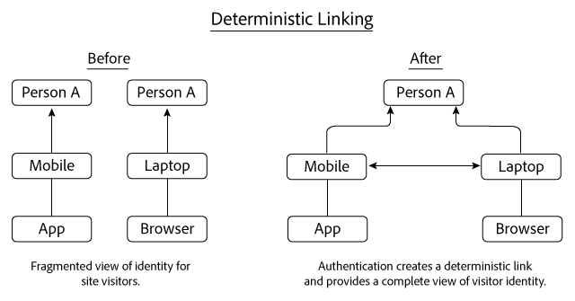
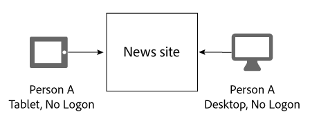
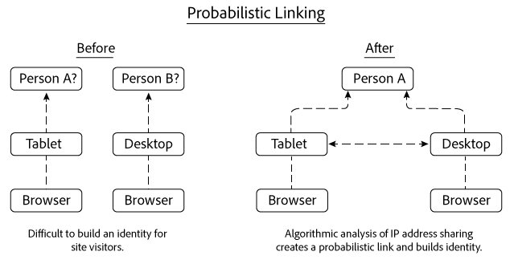
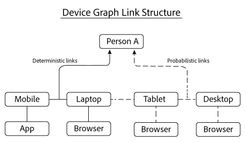

# 確定性和概率性連結{#deterministic-and-probabilistic-links}

「裝置圖」如何分析確定性和概率性資料，以建立將裝置連結在一起的地圖。

在內部 [!DNL Device Graph]程式中，內部程式會建立識別階層，將裝置對應並連結至個別匿名人員。 圖表的輸出包括可用於定位的跨裝置連結，以及精選Experience Cloud解決方案中公開的資料。 可處理資料的Adobe解決 [!DNL Device Graph] 方案包括Analytics、Audience Manager、Media Optimizer和Target。

分析 [!DNL Device Graph] 確定性和概率性資料，以建立將裝置連結在一起的地圖。 確定性資料根據散列登錄資訊將設備連結在一起。 概率資料會根據IP位址和其他中繼資料等資訊，將裝置連結在一起。 這些 [!DNL Device Graph] 連線可讓數位行銷人員觸及到人，而非裝置。 在中， [!DNL Device Graph]裝置的擁有者是真實人物的匿名表示。 確定性和概率性連結都有助於建立使用者識別結構。

>[!NOTE]
>
>在Adobe Experience Cloud Device Co-op中，裝置、人員和身分等 *詞語**有*&#x200B;特定意義 ** 。 例如，裝 *置可參照實體硬體* ，例如手機或平板電腦，以及在該硬體上執行的應用程式。 請參閱詞 [匯表](../glossary.md#glossgroup-0f47d7fbd76c4759801f565f341a386c) ，以瞭解定義。

## 什麼是連結？ {#section-2df4c6f01eba49369993146df0661f13}

當我們討論連結時，請務必記住裝置圖表中的實際 [!DNL Experience Cloud] 內容。 在此背景中，連結不是裝置間的實體連線。 相反地，連結是裝置圖形如何將不同裝置關聯至相同、未知的人。 例如，假設我們有行動電話和案頭瀏覽器。 當「裝置圖表」判斷這兩部裝置都是由同一名未知人員使用時，手機和瀏覽器就會被視為「連結」。 如下所述，裝置圖表會使用確定性和概率性連結來建立身分。 而在裝置圖表中，裝置的擁有者是真實人物的匿名表示。

## 確定性連結 {#section-33d41e828a674b398e36fe63da20ac09}

確定性連結基於驗證事件（例如，從設備到站點的登錄操作）將設備與人員關聯。 此動作會建立匿名識別碼，稱為消費者ID。 讓我們來看看確定性連結的運作方式。 在此範例中，人員A透過其行動裝置上的應用程式登入新聞網站。 當天晚些時候，A人再次登入，但這次是透過筆記型電腦的瀏覽器登入。

根據登錄資訊，設備圖：

* 瞭解透過行動電話／應用程式和筆記型電腦／瀏覽器裝置組合，向新聞網站驗證的A人。
* 將這些裝置連結至人員A。
* 根據與匿名人員相關聯的連結裝置建立身分識別。

>[!NOTE]
>
>此資料中 [!DNL Adobe Experience Cloud Device Co-op] 的或者 [!DNL Device Graph] 都不會收到實際的驗證資訊或個人識別資訊(PII)。 成員可 [!DNL Experience Cloud Device Co-op]將經密碼雜湊的唯一使用者ID傳入裝置圖表。 消費者ID代表圖形中已驗證的使用者，並保護消費者隱私。

## 概率連結 {#section-5f5aa755da984f9d851f7cb380262998}

概率連結會根據特性和中繼資料，以演算法將裝置與人員連接：

* 瀏覽行為
* IP位址
* 作業系統
* IDFA和GAID識別碼

讓我們來看看概率連結的運作方式。 在此範例中，人員A會先瀏覽其平板電腦上的新聞網站，然後再從桌上型電腦瀏覽。 瀏覽時，人員A不會登入新聞網站。 在每次個別瀏覽期間，平板電腦和案頭會共用相同的IP位址。

根據這項資訊，評估 [!DNL Device Graph] 兩部裝置之間的IP位址共用模式，並且如果結果顯示這些裝置屬於人員A，則會將這些裝置連結在一起。最終結果是由算法概率計算得出的身份層次。

在此範例中，裝置圖表會在這兩個裝置用於存取相同新聞網站後連結。 但是，裝置不必在同一個網站上檢視即可連結。 為說明這一點，讓我們假設此範例中的每個裝置都會造訪完全不同的網站。 該 [!DNL Device Graph] 算法仍然可以根據共用的IP地址和對其他資料的分析來構造概率鏈路。 此程式可讓Device Co-op的成員如此強大的概 [!DNL Experience Cloud] 率連結。

## 這兩種資料都提供價值 {#section-43d22d8c10634edcb261e7bda6fdf323}

確定性和概率性資料相輔相成。 相反，僅包含確定性資料的裝置圖表提供您個人身分的有限檢視。 若沒有驗證，裝置圖表將無法告訴您有關其他裝置和瀏覽您網站的人員。 概率資料可以建立這些連線，並協助您觸及未驗證的裝置、人員和家庭。

然而，確定性資料也很重要。 例如，它可以通過刪除在概率信號充足和重疊的地方（如咖啡店、圖書館、機場等）產生的假連結來改進概率決策。

透過這兩種資料，裝置圖表可讓您更全面地瞭解個人身分，而非只使用這兩種資料。

